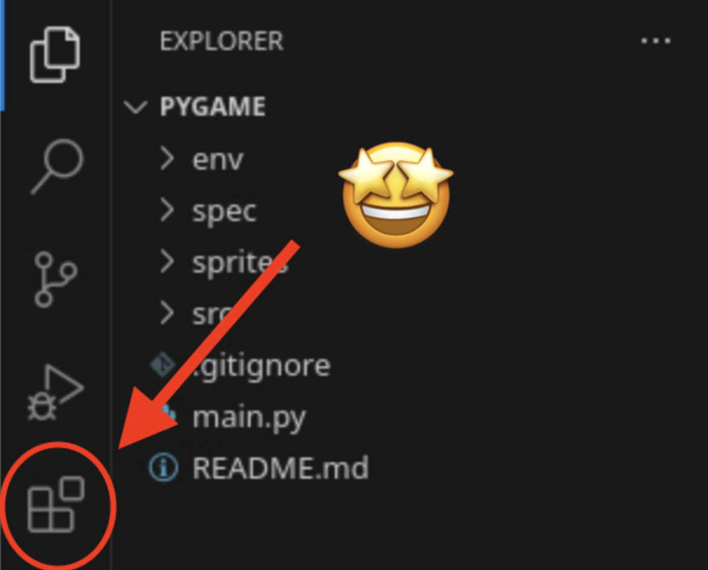
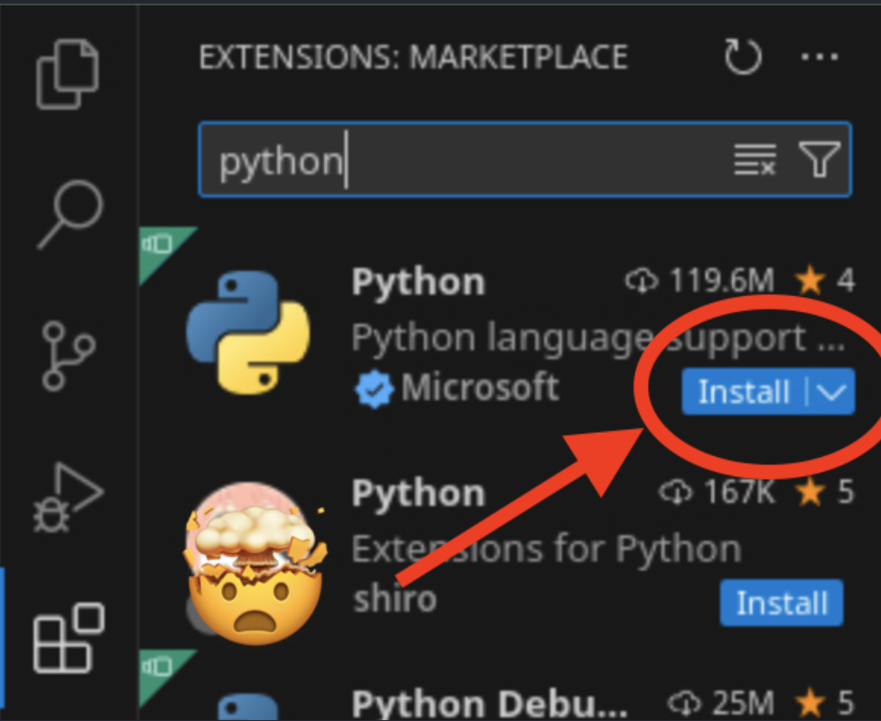
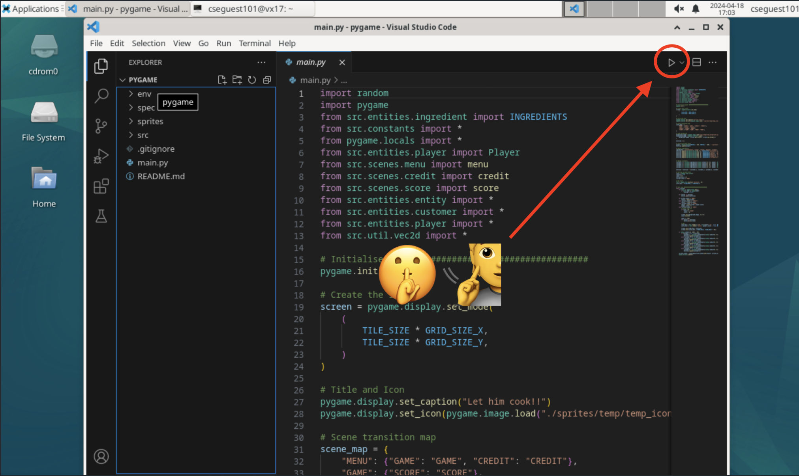

# 🐍 Continuers to Python! 🐍

## Links
[Slides](https://go.compclub.org/python)

[Feedback: Intro to Python](https://go.compclub.org/feedback-intro)

[Feedback: Continuers to Python](https://go.compclub.org/feedback-intermediate)

## Content Summary
0. Setting up
1. [Printing](./spec/1-printing.md)
2. [Variables](./spec/2-variables.md)
3. [Input](./spec/3-input.md)
4. [If-Else](./spec/4-ifelse.md)
5. [Loops](./spec/5-loops.md)

## Setting up
Before we start working, we first need to set up the Python extension on VSCode, so that we can make life easier :)

We first click the little tile button on the left sidebar


Then search up 'python' and install the first option


Yayy we're all ready to roll now!


## Running the Program
You can either click the `Run` button on the top right corner of VSCode like this:



orr you could use the terminal by first `cd`-ing (**c**hanging our **d**irectory -- ie the folder we are working in) and running our file manually
```
$ cd directory-name
$ python3 file_name.py
```
